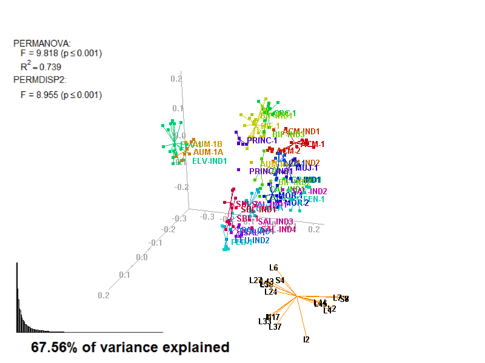
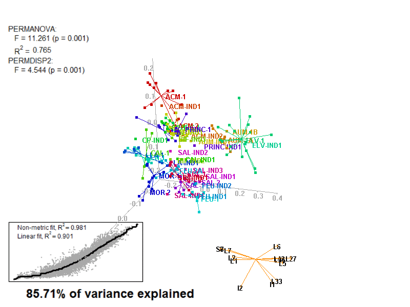

```{r, echo = FALSE, message=FALSE, warning=FALSE}
library(knitr)
opts_chunk$set(collapse = TRUE, comment = "#>")
library(png)
library(grid)
library(gridExtra)
library(cerUB)
library(biplot2d3d)
```

```{r, echo=FALSE, message=FALSE, warning=FALSE}
# this performs the initalization procedures
data(amphorae)

varCode <- code_variables(amphorae)

cleanAmphorae <- clean_and_format(
  amphorae,
  completion_variable = c(
    # The variable with completion info
    "CHARAC", 
    # the value indicating completion
    "complete"
  ), 
  categorical_columns = 1:112, 
  numerical_columns = 113:ncol(amphorae),
  # values converted to NA
  as_na = c("NULL", "indeterminate", "unfired"),
  # method for replacing NAs
  method = NULL, 
  # don't use the following variables
  columns_to_exclude = c("VOID_VESIC_MEGA", "VOID_VUGH_MEGA",
                         "VOID_CHAN_MEGA", "VOID_PLAN_MEGA",
                         "COAR_R_DAC_AND", "COAR_R_EVAP",
                         "COAR_R_CONGBREC", "COAR_R_SERP",
                         "COAR_C_SPL", "COAR_C_OPX",
                         "COAR_C_OL", "COAR_C_SIL",
                         "COAR_C_ST", "COAR_C_ZRN",
                         "COAR_C_PY", "FINE_C_OPX",
                         "FINE_C_ZRN"),
  # don't use the following observations
  # (Italic amphorae from Port Vendres 4)
  rows_to_exclude = c("PV4033", # PV4-IND4
                      "PV4017", # PV4-CAMP
                      # PV4-ITT
                      "PV4021", "PV4023", "PV4024", 
                      "PV4025", "PV4035", "PV4037",
                      # PV4-NAP
                      "PV4022", "PV4026", "PV4027", 
                      "PV4028", "PV4029", "PV4030",
                      "PV4036")
)
isShipwreck <-
  cleanAmphorae$Site_Name=="Cap del Vol" |
  cleanAmphorae$Site_Name=="Ullastres I" |
  cleanAmphorae$Site_Name=="Port-Vendres 4"

ProvenanceGroup <- c()
isTrueIND <- c()

# coerce the original group variables (factors) into character vectors
# so we can use stringr package to operate on them.
cleanAmphorae$FabricGroup <- 
  as.character(cleanAmphorae$FabricGroup)
cleanAmphorae$ChemReferenceGroup <- 
  as.character(cleanAmphorae$ChemReferenceGroup)

for (i in 1:nrow(cleanAmphorae)){
  groupChem <-
    stringr::str_split(cleanAmphorae$ChemReferenceGroup[i], "-")[[1]]
  groupFabric <-
    stringr::str_split(cleanAmphorae$FabricGroup[i], "-")[[1]]
  group <- ""
  isATrueInd <- FALSE

  if (groupChem[2] == "IND" || groupFabric[2] == "IND") {
    group <- cleanAmphorae$ChemReferenceGroup[i]
    if (!isShipwreck[i]) isATrueInd <- TRUE
    index <- 1
    for (j in 1:length(ProvenanceGroup)){
      if (ProvenanceGroup[j] == paste(group, index, sep = ""))
        index <- index + 1
    }
    group <- paste(group, index, sep = "")
    cleanAmphorae$ChemReferenceGroup[i] <- group
    cleanAmphorae$FabricGroup[i] <- group
  }
  else {
    if (groupChem[1] == "ULL" || 
        groupChem[1] == "PV4" || 
        groupChem[1] == "CDV") {
      group <- cleanAmphorae$ChemReferenceGroup[i]
    }
    else if (groupChem[1] == groupFabric[1]){
      group <- groupChem[1]
    }
  }
  ProvenanceGroup <- c(ProvenanceGroup, group[1])
  isTrueIND <- c(isTrueIND, isATrueInd)
}

factor_list <-
  list(
    Site = factor(cleanAmphorae$Site_Name[!isShipwreck]),
    FabricGroup = factor(cleanAmphorae$FabricGroup[!isShipwreck]),
    ChemGroup = factor(cleanAmphorae$ChemReferenceGroup[!isShipwreck]),
    ProvGroup = factor(ProvenanceGroup[!isShipwreck])
  )

factor_list_Shipwreck <-
  list(
    Site = factor(cleanAmphorae$Site_Name[!isTrueIND]),
    FabricGroup = factor(cleanAmphorae$FabricGroup[!isTrueIND]),
    ChemGroup = factor(cleanAmphorae$ChemReferenceGroup[!isTrueIND]),
    ProvGroup = factor(ProvenanceGroup[!isTrueIND])
  )

labels_code <- as.character(row.names(cleanAmphorae)) # using row names
labels_cross <- rep("+", nrow(cleanAmphorae)) # using +
labels_x <- rep(4, nrow(cleanAmphorae)) # using pch code
labels_point <- rep(20, nrow(cleanAmphorae)) # using pch code

labels_list <- list(
  Code = labels_code[!isShipwreck],
  Cross = labels_cross[!isShipwreck],
  X = labels_x[!isShipwreck],
  Point = labels_point[!isShipwreck]
)

labels_list_Shipwreck <- list(
  Code = labels_code[!isTrueIND],
  Cross = labels_cross[!isTrueIND],
  X = labels_x[!isTrueIND],
  Point = labels_point[!isTrueIND]
)

color_list <- list()

for (i in 1:length(factor_list)){
  cv <- rainbow(nlevels(factor_list[[i]]), v=.8)
  color_list[[i]] <- cv
  names(color_list)[i] = names(factor_list)[i]
}

color_list_Shipwreck <- list()

for (i in 1:length(factor_list_Shipwreck)){
  cv <- rainbow(nlevels(factor_list_Shipwreck[[i]]), v=.8)
  color_list_Shipwreck[[i]] <- cv
  names(color_list_Shipwreck)[i] = names(factor_list_Shipwreck)[i]
}

excep_cols <- c("INCLUS_DISTRIB","INCLUS_ORIENT","COAR_ROUNDNESS",
                "COAR_FORM","COAR_SPACING","COAR_SORTING","FINE_FORM")

chemVars16 <- c("Fe2O3","Al2O3","TiO2","MgO","CaO","SiO2",
                "Th","Nb","Zr","Y","Ce","Ga","V","Zn","Ni","Cr")


```

# Protocol 2 - Petrographic data {#prot2}

The following example applies protocol 2 to confirm workshops' petrographic groups.

Protocol 2 consist in: 

1. Select ordinal **_petrographic_** data;
2. Transform to **_ranks_**;
3. **_Extended Gower distance_**, using: 
  a. **Relative ranking difference** (RRD)
  b. **Neighbor interchange** (NI)
4. Apply ordination procedure:
  a. **_Principal Coordinates Analysis_** (PCoA)
  b. **_Non-metric Dimensional Scaling_** (NMDS)
5. Perform **_PERMANOVA & PERMDISP_** tests;

Last, search for outliers and re-do protocol excluding outliers.

NOTE: The [initial procedures](#init) must be ran at least once before any protocol can be applied.

The key references on the Extended Gower distance are:

> Pavoine, S., Vallet, J., Dufour, A.-B., Gachet, S., Daniel, H., 2009. On the challenge of treating various types of variables: application for improving the measurement of functional diversity. Oikos 118, 391-402. doi:10.1111/j.1600-0706.2008.16668.x

> Podani, J., 1999. Extending Gower's General Coefficient of Similarity to Ordinal Characters on JSTOR. Taxon 48, 331-340. doi:10.2307/1224438

> Gower, J.C., 1971. A General Coefficient of Similarity and Some of Its Properties. Biometrics 27, 857-871. doi:10.2307/2528823

\pagebreak

## Ordination procedure

Depending on which type of distance calculation (RRD/NI), protocol 2 performs different ordination methods (PCoA/NMDS). Both PCoA and NMDS require specifying the number of dimensions in which to project the data. Therefore, you must generate specific 2D and 3D ordination objects:

```{r, results='hide', warning=FALSE, message=FALSE}
prot2a_2d <- apply_ordination(cleanAmphorae[!isShipwreck,],
                              "2a", # select protocol 2a (RRD & PCoA)
                              exception_columns = excep_cols,
                              variable_tags = varCode)

prot2b_2d <- apply_ordination(cleanAmphorae[!isShipwreck,],
                              "2b", # select protocol 2a (NI & NMDS)
                              exception_columns = excep_cols,
                              variable_tags = varCode)

prot2a_3d <- apply_ordination(cleanAmphorae[!isShipwreck,],
                              "2a", # select protocol 2a (RRD & PCoA)
                              exception_columns = excep_cols,
                              variable_tags = varCode,
                              dimensions = 3)

prot2b_3d <- apply_ordination(cleanAmphorae[!isShipwreck,],
                              "2b", # select protocol 2a (NI & NMDS)
                              exception_columns = excep_cols,
                              variable_tags = varCode,
                              dimensions = 3)
```

\pagebreak

The ordination objects generated with protocol 2 are different from those in protocol 1 since it uses different functions. However, the main components are still the same: the projection of observations or *scores* (**points**) and of variables or *loadings*.

```{r}
class(prot2a_2d)
names(prot2a_2d)
class(prot2b_2d)
names(prot2b_2d)
```

\pagebreak

## Test the given fabric groups

The fabric groups defined in previous studies can be tested against Protocol 2 distance matrices. We can use either "prot2a_2d\$dist_matrix" or "prot2a_3d\$dist_matrix", because they are the same. Remember that this test batch may take several minutes.

```{r}
prot2a_tests <- test_groups(prot2a_2d$dist_matrix, 
                            factor_list$FabricGroup)
prot2b_tests <- test_groups(prot2b_2d$dist_matrix,
                            factor_list$FabricGroup)
```

These tests were explained in [protocol 1](#tests).

\pagebreak

## Biplots

The details on how to create biplots is already explained in [protocol 1](#biplot). Concerning protocol 2, we can compare the results of version *2a* (RRD, PCoA) and *2b* (NI, NMDS).

\pagebreak


### Biplot 2D

```{r, fig.width=4.5, fig.height=4.5, fig.cap = "protocol 2a"}
arrows_label_adj <- rbind(c(.5,.8),c(.5,1),c(.5,1),c(.5,0),c(.5,1),
                          c(.5,0),c(0,.5))
row.names(arrows_label_adj) <- c("L48","L24","L5","L36","S7",
                                 "S8","S11")

biplot2d3d::biplot_2d(prot2a_2d,
                      ordination_method = "PCoA",
                      invert_coordinates = c (TRUE,TRUE),
                      xlim = c(-.26,.35),
                      ylim = c(-.31,.35),
                      point_type = "point",
                      groups = factor_list$FabricGroup,
                      group_color = color_list$FabricGroup,
                      group_label_cex = 0.6,
                      arrow_mim_dist = 0.5,
                      arrow_label_cex = 0.6,
                      arrow_fig = c(.6,.95,0,.35),
                      arrow_label_adj_override = arrows_label_adj,
                      subtitle = prot2a_2d$sub2D,
                      test_text = prot2a_tests$text(prot2a_tests),
                      test_cex = 0.8,
                      test_fig = c(0, 0.5, 0.62, .99),
                      fitAnalysis_fig = c(0,.7,.05,.5),
                      output_type = "preview")
```

\pagebreak

```{r, fig.width=4.5, fig.height=4.5, fig.cap = "protocol 2b"}
arrows_label_adj <- rbind(c(.5,1),c(.5,0),c(.5,1),c(.5,1),c(.5,0),
                          c(0,.5),c(1,.5))
row.names(arrows_label_adj) <- c("S7","S8","CLAY","L24","L43",
                                 "L5","L36")

biplot2d3d::biplot_2d(prot2b_2d,
                      ordination_method = "NMDS",
                      xlim = c(-.42,.38),
                      ylim = c(-.45,.25),
                      point_type = "point",
                      groups = factor_list$FabricGroup,
                      group_color = color_list$FabricGroup,
                      group_label_cex = 0.6,
                      arrow_mim_dist = .5,
                      arrow_label_cex = 0.6,
                      arrow_fig = c(.6,.95,0,.35),
                      arrow_label_adj_override = arrows_label_adj,
                      subtitle = prot2b_2d$sub2D,
                      test_text = prot2b_tests$text(prot2b_tests),
                      test_cex = 0.8,
                      test_fig = c(0, 0.5, 0.62, .99),
                      fitAnalysis_stress_axis_cex = 0.8,
                      fitAnalysis_fig = c(.1,.6,.1,.4),
                      output_type = "preview")
```

\pagebreak


### Biplot 3D

```{r, eval=FALSE}
biplot2d3d::biplot_3d(prot2a_3d,
                      ordination_method = "PCoA",
                      point_type = "point",
                      groups = factor_list$FabricGroup,
                      group_color = color_list$FabricGroup,
                      group_representation = "stars",
                      star_centroid_radius = 0,
                      star_label_cex = .8,
                      arrow_min_dist = .5,
                      arrow_body_length = .025,
                      subtitle = prot2a_3d$sub3D,
                      test_text = prot2a_tests$text(prot2a_tests),
                      test_cex = 1.25,
                      test_fig = c(0, 0.5, 0.65, .99),
                      view_zoom = 0.9)

biplot2d3d::animation(directory = directories$prot2,
                      file_name = "Prot2a_Biplot3D")
```



\pagebreak

```{r, eval=FALSE}
biplot2d3d::biplot_3d(prot2b_3d,
                      ordination_method = "NMDS",
                      point_type = "point",
                      groups = factor_list$FabricGroup,
                      group_color = color_list$FabricGroup,
                      group_representation = "stars",
                      star_centroid_radius = 0,
                      star_label_cex = .8,
                      arrow_min_dist = .5,
                      arrow_body_length = .025,
                      subtitle = prot2b_3d$sub3D,
                      test_text = prot2b_tests$text(prot2b_tests),
                      test_cex = 1.25,
                      test_fig = c(0, 0.5, 0.65, .99),
                      view_zoom = 0.9)

biplot2d3d::animation(directory = directories$prot2,
                      file_name = "Prot2b_Biplot3D")
```



