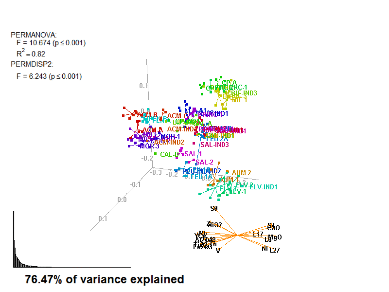

---
output:
  html_document:
    fig_caption: yes
    fig_height: 7
    fig_width: 7
    highlight: tango
fontsize: 12pt
geometry: margin = 1.2in
header-includes:
- \usepackage{placeins}
- \usepackage{fancyhdr}
- \usepackage{setspace}
- \usepackage{chngcntr}
- \usepackage{microtype}
always_allow_html: yes
urlcolor: blue
---

```{r, echo = FALSE, message=FALSE, warning=FALSE}
library(knitr)
opts_chunk$set(collapse = TRUE, comment = "#>")
library(png)
library(grid)
library(gridExtra)
library(cerUB)
library(biplot2d3d)
```

```{r, echo=FALSE, message=FALSE, warning=FALSE}
# this performs the initalization procedures
data(amphorae)

varCode <- code_variables(amphorae)

cleanAmphorae <- clean_and_format(
  amphorae,
  completion_variable = c(
    # The variable with completion info
    "CHARAC", 
    # the value indicating completion
    "complete"
  ), 
  categorical_columns = 1:112, 
  numerical_columns = 113:ncol(amphorae),
  # values converted to NA
  as_na = c("NULL", "indeterminate", "unfired"),
  # method for replacing NAs
  method = NULL, 
  # don't use the following variables
  columns_to_exclude = c("VOID_VESIC_MEGA", "VOID_VUGH_MEGA",
                         "VOID_CHAN_MEGA", "VOID_PLAN_MEGA",
                         "COAR_R_DAC_AND", "COAR_R_EVAP",
                         "COAR_R_CONGBREC", "COAR_R_SERP",
                         "COAR_C_SPL", "COAR_C_OPX",
                         "COAR_C_OL", "COAR_C_SIL",
                         "COAR_C_ST", "COAR_C_ZRN",
                         "COAR_C_PY", "FINE_C_OPX",
                         "FINE_C_ZRN"),
  # don't use the following observations
  # (Italic amphorae from Port Vendres 4)
  rows_to_exclude = c("PV4033", # PV4-IND4
                      "PV4017", # PV4-CAMP
                      # PV4-ITT
                      "PV4021", "PV4023", "PV4024", 
                      "PV4025", "PV4035", "PV4037",
                      # PV4-NAP
                      "PV4022", "PV4026", "PV4027", 
                      "PV4028", "PV4029", "PV4030",
                      "PV4036")
)
isShipwreck <-
  cleanAmphorae$Site_Name=="Cap del Vol" |
  cleanAmphorae$Site_Name=="Ullastres I" |
  cleanAmphorae$Site_Name=="Port-Vendres 4"

ProvenanceGroup <- c()
isTrueIND <- c()

# coerce the original group variables (factors) into character vectors
# so we can use stringr package to operate on them.
cleanAmphorae$FabricGroup <- 
  as.character(cleanAmphorae$FabricGroup)
cleanAmphorae$ChemReferenceGroup <- 
  as.character(cleanAmphorae$ChemReferenceGroup)

for (i in 1:nrow(cleanAmphorae)){
  groupChem <-
    stringr::str_split(cleanAmphorae$ChemReferenceGroup[i], "-")[[1]]
  groupFabric <-
    stringr::str_split(cleanAmphorae$FabricGroup[i], "-")[[1]]
  group <- ""
  isATrueInd <- FALSE

  if (groupChem[2] == "IND" || groupFabric[2] == "IND") {
    group <- cleanAmphorae$ChemReferenceGroup[i]
    if (!isShipwreck[i]) isATrueInd <- TRUE
    index <- 1
    for (j in 1:length(ProvenanceGroup)){
      if (ProvenanceGroup[j] == paste(group, index, sep = ""))
        index <- index + 1
    }
    group <- paste(group, index, sep = "")
    cleanAmphorae$ChemReferenceGroup[i] <- group
    cleanAmphorae$FabricGroup[i] <- group
  }
  else {
    if (groupChem[1] == "ULL" || 
        groupChem[1] == "PV4" || 
        groupChem[1] == "CDV") {
      group <- cleanAmphorae$ChemReferenceGroup[i]
    }
    else if (groupChem[1] == groupFabric[1]){
      group <- groupChem[1]
    }
  }
  ProvenanceGroup <- c(ProvenanceGroup, group[1])
  isTrueIND <- c(isTrueIND, isATrueInd)
}

factor_list <-
  list(
    Site = factor(cleanAmphorae$Site_Name[!isShipwreck]),
    FabricGroup = factor(cleanAmphorae$FabricGroup[!isShipwreck]),
    ChemGroup = factor(cleanAmphorae$ChemReferenceGroup[!isShipwreck]),
    ProvGroup = factor(ProvenanceGroup[!isShipwreck])
  )

factor_list_Shipwreck <-
  list(
    Site = factor(cleanAmphorae$Site_Name[!isTrueIND]),
    FabricGroup = factor(cleanAmphorae$FabricGroup[!isTrueIND]),
    ChemGroup = factor(cleanAmphorae$ChemReferenceGroup[!isTrueIND]),
    ProvGroup = factor(ProvenanceGroup[!isTrueIND])
  )

labels_code <- as.character(row.names(cleanAmphorae)) # using row names
labels_cross <- rep("+", nrow(cleanAmphorae)) # using +
labels_x <- rep(4, nrow(cleanAmphorae)) # using pch code
labels_point <- rep(20, nrow(cleanAmphorae)) # using pch code

labels_list <- list(
  Code = labels_code[!isShipwreck],
  Cross = labels_cross[!isShipwreck],
  X = labels_x[!isShipwreck],
  Point = labels_point[!isShipwreck]
)

labels_list_Shipwreck <- list(
  Code = labels_code[!isTrueIND],
  Cross = labels_cross[!isTrueIND],
  X = labels_x[!isTrueIND],
  Point = labels_point[!isTrueIND]
)

color_list <- list()

for (i in 1:length(factor_list)){
  cv <- rainbow(nlevels(factor_list[[i]]), v=.8)
  color_list[[i]] <- cv
  names(color_list)[i] = names(factor_list)[i]
}

color_list_Shipwreck <- list()

for (i in 1:length(factor_list_Shipwreck)){
  cv <- rainbow(nlevels(factor_list_Shipwreck[[i]]), v=.8)
  color_list_Shipwreck[[i]] <- cv
  names(color_list_Shipwreck)[i] = names(factor_list_Shipwreck)[i]
}

excep_cols <- c("INCLUS_DISTRIB","INCLUS_ORIENT","COAR_ROUNDNESS",
                "COAR_FORM","COAR_SPACING","COAR_SORTING","FINE_FORM")

chemVars16 <- c("Fe2O3","Al2O3","TiO2","MgO","CaO","SiO2",
                "Th","Nb","Zr","Y","Ce","Ga","V","Zn","Ni","Cr")


```

# Protocol 3 - Geochemical and petrographic data

The following example applies protocol 3 to confirm workshops' provenance groups.

Protocol 3 consist in: 

1. Select **_geochemical_** compositional data (CoDa) and ordinal **_petrographic_** data;
2. **_Centred log-ratio transformation_** (clr) and transform to **_ranks_**;
3. **_Extended Gower distance_**, using **Relative ranking difference** (RRD);
4. Apply **_Principal Coordinates Analysis_** (PCoA);
5. Perform **_PERMANOVA & PERMDISP_** tests;

Last, search for outliers and re-do protocol excluding outliers.

NOTE: The [initial procedures](2_init.html) must be ran at least once before any protocol can be applied.

See [protocol 2](4_prot2.html), for consulting references on the extended Gower distance.


## Ordination procedure

Protocol 3 performs PCoA on a distance matrix calculated with Extended Gower coefficient of dissimilarity, combining Euclidean distances on transformed compositional data (50%) and RRD on ranked petrographic data (50%). As in protocol 2, PCoA requires specifying the number of dimensions and so you must 2D and 3D ordination objects separately:

```{r, results='hide', warning=FALSE, message=FALSE}
prot3_2d <- apply_ordination(cleanAmphorae[!isShipwreck,], # no shipwrecks
                             "3", # select protocol 3
                             exception_columns = excep_cols,
                             variable_tags = varCode,
                             coda_override = chemVars16,
                             coda_transformation = "CLR")

prot3_3d <- apply_ordination(cleanAmphorae[!isShipwreck,], # no shipwrecks
                             "3", # select protocol 3
                             exception_columns = excep_cols,
                             variable_tags = varCode,
                             coda_override = chemVars16,
                             coda_transformation = "CLR",
                             dimensions = 3)
```

## Simplify CoDa names

We may want to simplify the names of the transformed variables before plotting them in a biplot. 

```{r}
prot3_2d <- simplify_coda_names(prot3_2d)
prot3_3d <- simplify_coda_names(prot3_3d)
```

## Test the given provenance groups

Because protocol 3 uses both geochemical and petrographic information, we can test the provenance assigned to the amphorae samples.

```{r}
prot3_tests <- test_groups(prot3_2d$dist_matrix, 
                           factor_list$ProvGroup)
```

These tests were explained in [protocol 1](3_prot1.html).

\pagebreak

## Biplots

The details on how to create biplots is already explained in [protocol 1](3_prot1.html). Unlike protocol 2, protocol 3 only generates one kind of projection (RRD, PCoA).

### Biplot 2D

```{r, fig.width=4.5, fig.height=4.5, fig.cap = "protocol 3"}
arrows_label_adj <- rbind(c(.5,.8),c(.5,1),c(.5,1),c(.5,0),c(.5,1),
                          c(.5,0),c(0,.5))
row.names(arrows_label_adj) <- c("L48","L24","L5","L36","S7",
                                 "S8","S11")

biplot2d3d::biplot_2d(prot3_2d,
                      ordination_method = "PCoA",
                      invert_coordinates = c (TRUE,TRUE),
                      ylim = c(-.3,.29),
                      point_type = "point",
                      groups = factor_list$FabricGroup,
                      group_color = color_list$FabricGroup,
                      group_label_cex = 0.6,
                      arrow_mim_dist = 0.5,
                      arrow_label_cex = 0.6,
                      arrow_fig = c(.6,.95,0,.35),
                      arrow_label_adj_override = arrows_label_adj,
                      subtitle = prot3_2d$sub2D,
                      test_text = prot3_tests$text(prot3_tests),
                      test_fig = c(0, 0.5, 0.62, .99),
                      fitAnalysis_fig = c(0,.7,.05,.5),
                      output_type = "preview")
```

\pagebreak

### Biplot 3D

```{r, eval=FALSE}
biplot2d3d::biplot_3d(prot3_3d,
                       ordination_method = "PCoA",
                       point_type = "point",
                       groups = factor_list$FabricGroup,
                       group_color = color_list$FabricGroup,
                       group_representation = "stars",
                       star_centroid_radius = 0,
                       star_label_cex = .8,
                       arrow_min_dist = .5,
                       arrow_body_length = .025,
                       subtitle = prot3_3d$sub3D,
                       test_text = prot3_tests$text(prot3_tests),
                       test_cex = 1.25,
                       test_fig = c(0, 0.5, 0.65, .99),
                       view_zoom = 0.9)

biplot2d3d::animation(directory = directories$prot3,
                       file_name = "Prot3_Biplot3D")
```



[Back to index](Main_Using_cerUB.html)
